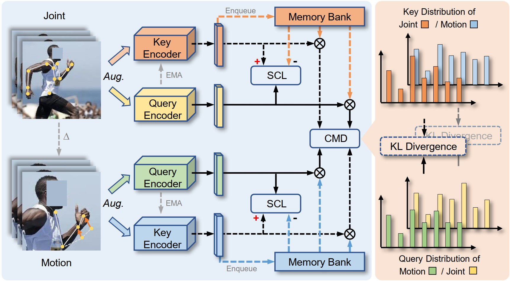

# CMD: Self-supervised 3D Action Representation Learning with Cross-modal Mutual Distillation
[Yunyao Mao](http://home.ustc.edu.cn/~myy2016), [Wengang Zhou](http://staff.ustc.edu.cn/~zhwg/index.html), Zhenbo Lu, Jiajun Deng, and [Houqiang Li](http://staff.ustc.edu.cn/~lihq) 

### Accepted by **ECCV 2022 (Oral)**. [[Paper Link]](https://arxiv.org/pdf/2208.12448.pdf)

This repository includes Python (PyTorch) implementation of the CMD.



## Abstract
In 3D action recognition, there exists rich complementary information between skeleton modalities. Nevertheless, how to model and
utilize this information remains a challenging problem for self-supervised
3D action representation learning. In this work, we formulate the crossmodal interaction as a bidirectional knowledge distillation problem. Different from classic distillation solutions that transfer the knowledge of a fixed and pre-trained teacher to the student, in this work, the knowledge is continuously updated and bidirectionally distilled between modalities. To this end, we propose a new Cross-modal Mutual Distillation (CMD) framework with the following designs. On the one hand, the neighboring similarity distribution is introduced to model the knowledge learned in each modality, where the relational information is naturally suitable for the contrastive frameworks. On the other hand, asymmetrical configurations are used for teacher and student to stabilize the distillation process and to transfer high-confidence information between modalities. By derivation, we find that the cross-modal positive mining in previous works can be regarded as a degenerated version of our CMD. We perform extensive experiments on NTU RGB+D 60, NTU RGB+D 120, and PKU-MMD II datasets. Our approach outperforms existing self-supervised methods and sets a series of new records.

## Requirements

```bash
python==3.8.13
torch==1.8.1+cu111
torchvision==0.9.1+cu111
tensorboard==2.9.0
scikit-learn==1.1.1
tqdm==4.64.0
numpy==1.22.4
```

## Training and Testing
Please refer to the bash scripts

## Pretrained Models
NTU-60 and NTU-120: [pretrained_models](https://rec.ustc.edu.cn/share/5f6a5ee0-01dd-11ed-b9ae-8301ca6d3d37)

## Citation
If you find this work useful for your research, please consider citing our work:
```
@inproceedings{Mao_2022_CMD,
    title={CMD: Self-supervised 3D Action Representation Learning with Cross-modal Mutual Distillation},
    author={Mao, Yunyao and Zhou, Wengang and Lu, Zhenbo and Deng, Jiajun and Li, Houqiang},
    booktitle={European Conference on Computer Vision (ECCV)},
    year={2022}
}
```

## Acknowledgment
The framework of our code is based on [skeleton-contrast](https://github.com/fmthoker/skeleton-contrast).
